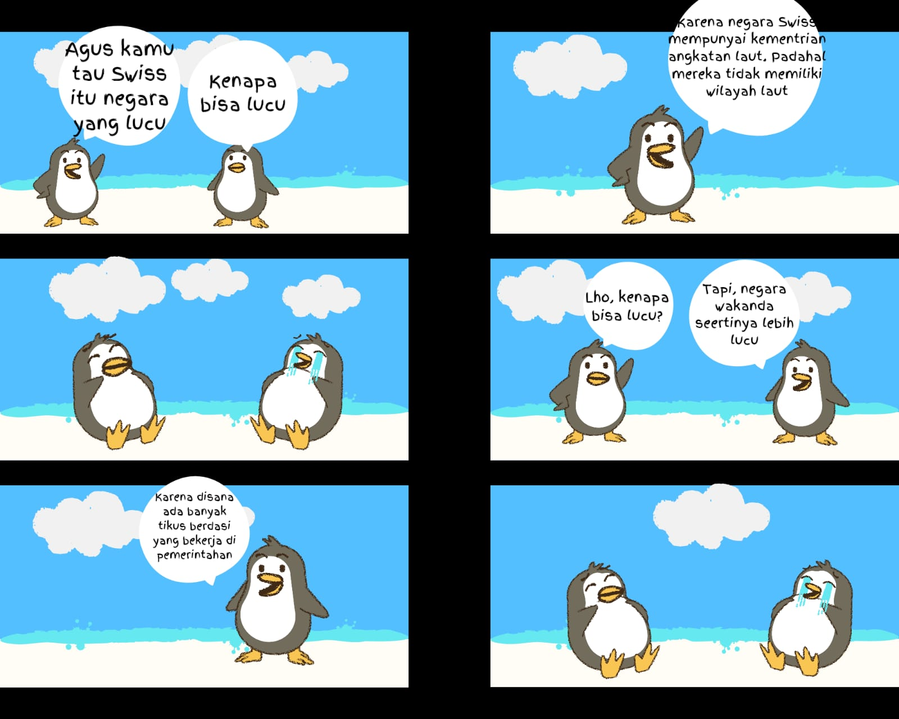

# Arya-Saputra
Web

<!DOCTYPE html>
<html lang="en">
<head>
    <meta charset="UTF-8">
    <meta name="viewport" content="width=device-width, initial-scale=1.0">
    <link rel="stylesheet" href="style.css">
    <title>Komik Strip</title>
    <meta name="description" content="Situs web komik strip kreatif">
    <meta name="keywords" content="komik strip, seni, hiburan">
</head>
<body>

    body {
    font-family: Arial, sans-serif;
    margin: 0;
    padding: 0;
    background-color: #f5f5f5;
}

/* Gaya untuk header */
header {
    background-color: #333;
    color: #fff;
    text-align: center;
    padding: 20px 0;
}

/* Gaya untuk navigasi */
nav ul {
    list-style-type: none;
    margin: 0;
    padding: 0;
}

nav ul li {
    display: inline;
    margin-right: 20px;
}

nav ul li a {
    text-decoration: none;
    color: #fff;
    font-weight: bold;
    transition: color 0.3s;
}

nav ul li a:hover {
    color: #ff6600;
}

h1 {
    font-size: 42px;
    margin: 20px 0;
    color: rgb(255, 255, 255);
}

.comic-strip img {
    max-width: 100%;
    height: auto;
    display: block;
    margin: 0 auto;
    box-shadow: 0 4px 6px rgba(0, 0, 0, 0.1);
}

footer {
    background-color: rgb(202, 170, 100);
    color: #fff;
    text-align: center;
    padding: 10px 0;
}

footer a {
    text-decoration: none;
    color: #fff;
    font-weight: bold;
}

footer a:hover {
    text-decoration: underline;
    color: #ff6600;
}
    <header>
        <nav>
            <ul>
                <li><a href="#">Beranda</a></li>
                <li><a href="#">Komik Terbaru</a></li>
            </ul>
        </nav>
        <h1>Komik Strip</h1>
    </header>
    <main>
        <section class="comic-strip">
            
        </section>
    </main>
    <footer>
        
&copy; 2023 I Made Dwi Arya Saputra

    </footer>
</body>
</html>
